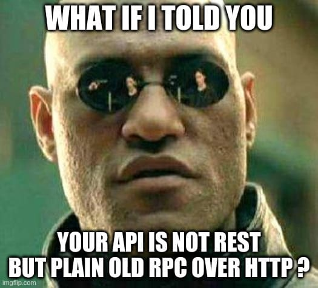

# HATEOAS

> Hypermedia as the engine of application state

En este punto debemos preguntarnos:

Hypermedia as the engine of application state nos dice que debemos enviar, junto con el estado del recurso, los diferentes estados a los cuales me puedo "mover" vía hypermedia.

Qué beneficios tiene HATEOAS?

- Autodescubrimiento
- La posibilidad de tener un cliente universal que se monte a partir de la respuesta recibida.

Existen especificaciones que nos indican cómo deberíamos implementar las respuestas del servidor si queremos implementar HATEOAS en nuestro servicio REST:

- [HAL](http://stateless.co/hal_specification.html)
  - application/hal+json
- [JSON-LD](https://json-ld.org/)
  - application/ld+json
- [Collection+JSON](http://amundsen.com/media-types/collection/)
  - application/vnd.collection+json
- [SIREN](https://github.com/kevinswiber/siren)
  - application/vnd.siren+json
- [JSON:API](https://jsonapi.org/)
  - application/vnd.api+json
- [OHM](https://github.com/cbornet/ohm)
  - application/ohm+json
  - OpenApi
    - Swagger
